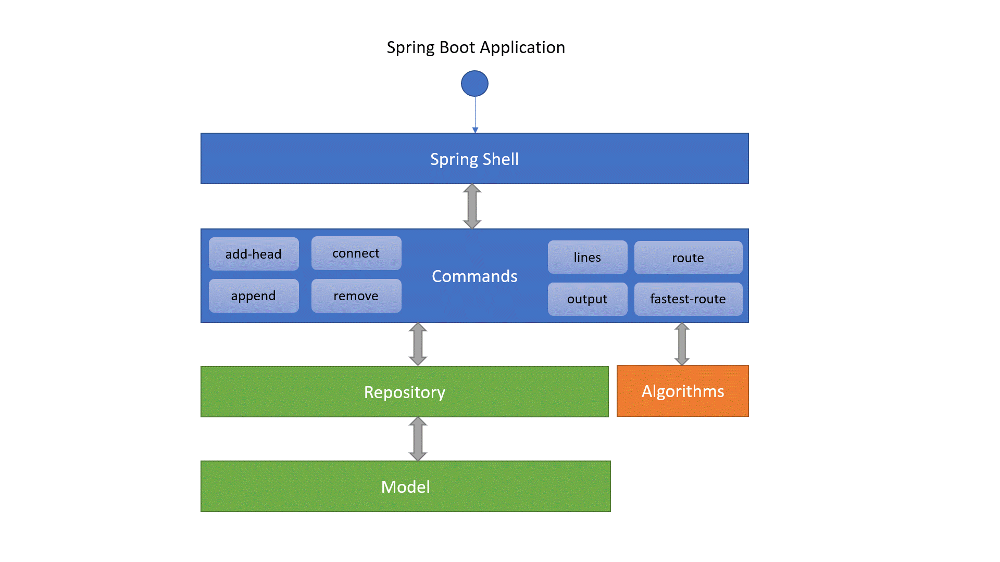

## About

This project demonstrates the capabilities of the Spring Shell framework, as well as testing examples using the Spock
Framework.

The solution of the [HyperMetro](https://hyperskill.org/projects/120) project was taken as the basis. This is a console
application that loads a subway map and allows you to execute various commands to work with the metro schema.

In particular, you can find the shortest or fastest route between stations, print various reports, and edit the metro
map.

## Technologies used

When creating this project, I used:

- Java 17
- Gradle
- Spring Boot + Spring Shell
- Jackson JSON parser
- Spock Framework

## How to build and run the project

To build the application use this command:

`./gradlew bootJar`

In order to run the application you should specify a metro schema as argument:

`$ java -jar build/libs/hypermetro-1.0-SNAPSHOT.jar london.json`

## Commands

- add-head line station
- append line station
- remove line station
- connect line1 station1 line2 station2
- output line
- route line1 station1 line2 station2
- fastest-route line1 station1 line2 station2

## Documentation

You may check the report and the documentation:
- [JavaDoc](https://rabestro.github.io/hypermetro/javadoc) for the program
- [Specifications](https://rabestro.github.io/hypermetro/spock-reports) by Spock Reports
- [Tests Coverage](https://rabestro.github.io/hypermetro/coverage) report
- [Gradle unit test](https://rabestro.github.io/hypermetro/reports/test) report

## Hi-Level Architecture

