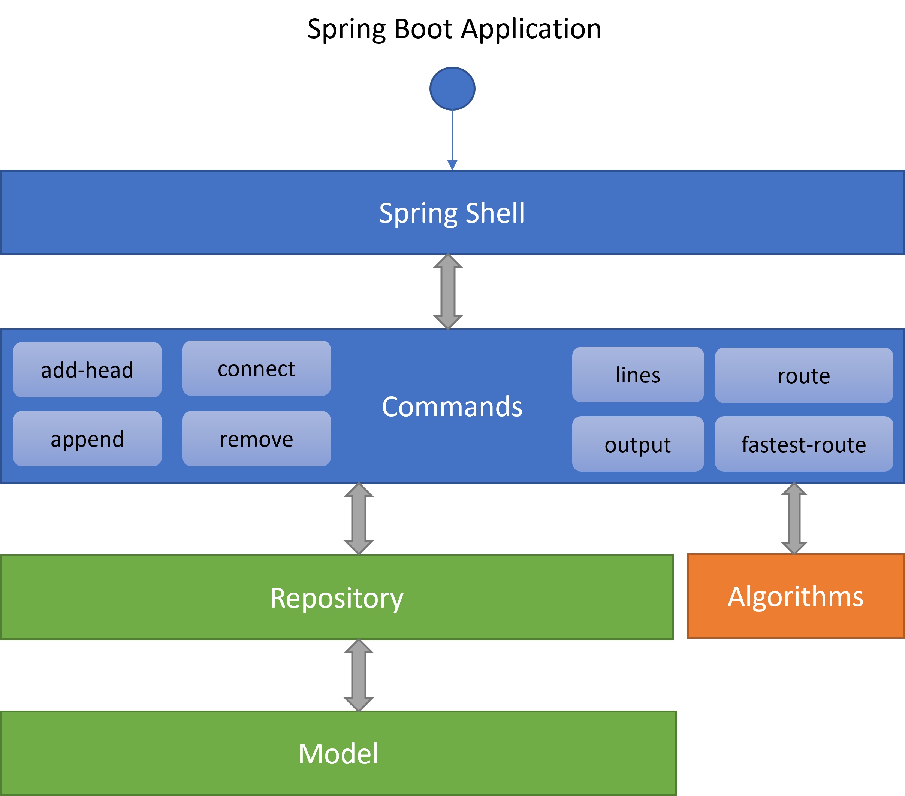

[](https://sonarcloud.io/summary/new_code?id=rabestro_hypermetro)

## About

This project demonstrates the capabilities of the Spring Shell framework, as well as testing examples using the Spock
Framework.

The solution of the [HyperMetro](https://hyperskill.org/projects/120) project was taken as the basis. This is a console
application that loads a subway map and allows you to execute various commands to work with the metro schema.

In particular, you can find the shortest or fastest route between stations, print various reports, and edit the metro
map.

## Technologies used

When creating this project, I used:

- Java 17
- Gradle
- Spring Boot + Spring Shell
- Jackson JSON parser
- Spock Framework

## How to build and run the project

To build the application you may use this command:

`./gradlew assemble`

This command creates executable jar, so on Linux/Mac you may run it by

`./build/libs/hypermetro-1.0-SNAPSHOT.jar ../../london.json`

On Windows and also on Linux/Mac systems you can run it by the command:

`$ java -jar build/libs/hypermetro-1.0-SNAPSHOT.jar london.json`

Please note, that in order to run the application you should specify a metro schema as an argument.


### AVAILABLE COMMANDS

```text
Built-In Commands
    clear: Clear the shell screen.
    exit, quit: Exit the shell.
    help: Display help about available commands.
    history: Display or save the history of previously run commands
    script: Read and execute commands from a file.
    stacktrace: Display the full stacktrace of the last error.

Metro Commands
    add-head: Adds a new station at the beginning of the metro line
    append: Adds a new station at the end of the line
    connect: Adds a transfer connection between two metro stations
    fastest-route: Finds and prints the fastest route between two metro stations
    lines: Prints information about metro lines
    output: Outputs all stations for a given metro line
    remove: Removes a station from the metro map
    route: Finds and prints the shortest route between two metro stations

```
## Documentation

You may check the documentation:
- [JavaDoc](https://rabestro.github.io/hypermetro/javadoc) for the program
- [Specifications](https://rabestro.github.io/hypermetro/spock-reports) by Spock Reports

## Hi-Level Architecture


